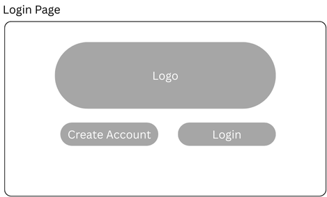
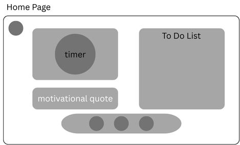
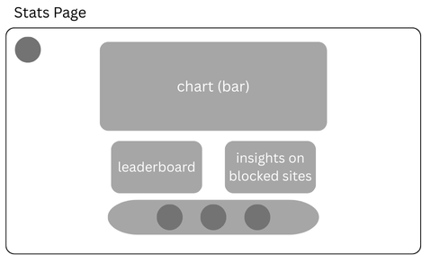
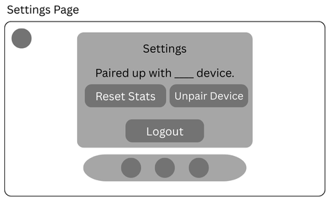

# Focuseal Wireframes

This document contains the inital wireframe sketches and layout descriptions for the Focuseal UI.

## 1. Login Page
- Create Account button to create an account
- Login button to log into an existing account

## 2. Home Page
- Pomodoro timer to cout down how much longer to work
- Motivational quote to keep on going
- To do list to keep track of any tasks
- Navigation bar at the bottom to switch between pages
- Dark mode option at the top left for different themes

## 3. Stats Page
- Bar chart to see overall productivity progress/stats
- Leaderboard (additional features) with friends
- Insights/stats on blocked sites

## 4. Settings Page
- Limited settings as for now
- Option to log out of account
- Option to reset stats for whatever reason
- Option to unpair device if wanted (to pair a new device or any other reasons)

## Wireframe Sketches

